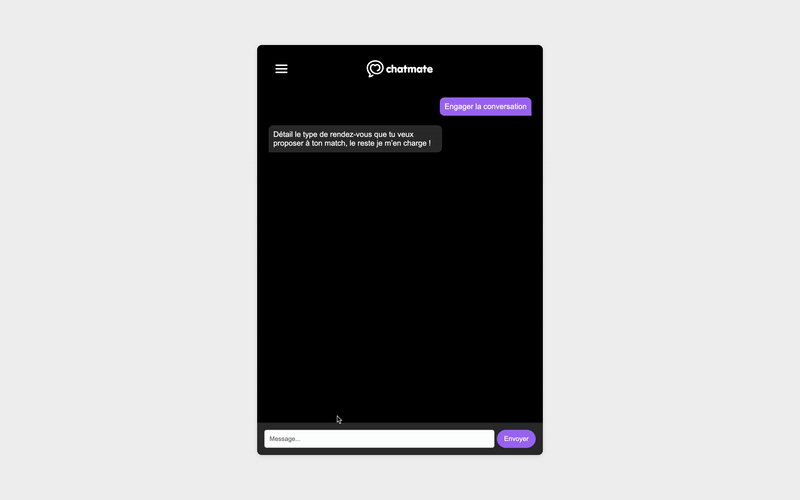

# ChatMate

## Utilisation

- Préparez l'environnement: `python3 -m venv venv`
- Activez l'environnement: `. venv/bin/activate`
- Mettez pip à jour: `pip install -U pip`
- Installez les requirements: `pip install -U -r required.txt`
- Lancez le serveur: `python3 app.py`
- Accéder à l'application via `index.html`

## Demo
# ChatMate
